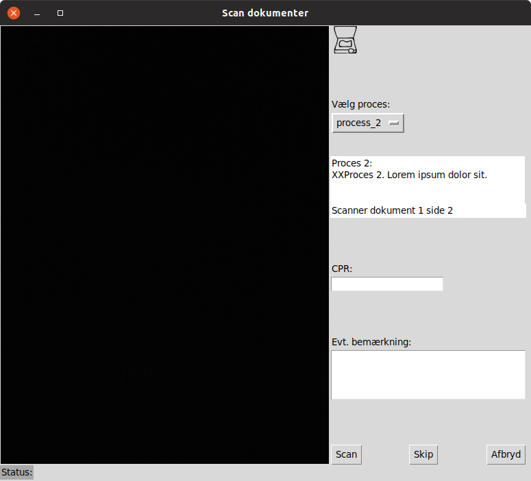

# Process scanning

The plan is to create a desktop application that scans documents in a predefined sequence based on profiles.

Scanning is done with a web camera.

## Profile

A profile could look like this:

`{"process":[`
	`{"meta":`
		`{"name":"Proces 2",`
		`"description":"XXProces 2. Lorem ipsum dolor sit.",`
		`"merge_documents":false,`
		`"AllowComment":true}`
	`},`
	`{"delevery":`
		`{"delevery_type":"file",`
		`"destination":"some\\path"}`
	`},`
	`{"sbsys":`
		`{"KLe":"27.27.10",`
		`"SkabelonID":1234}`
	`},`
	`{"documents":`
		`[{"name":"Document 1",` 
		`"mandatory":true,`
		`"pages":2`
		`},`
		`{"name":"Bilag",` 
		`"mandatory":false,`
		`"pages":1`
		`}]`
	`}`

`]`
`}`

# Screen

## Todo

I have a long todo-list:

- The 'Skip' routine is still to be done
- Some how the Scan button is still active after it has been disabled.
- ~~Select camera (if several)~~
- Get data from identifier field and comments
- Update status
- ~~Rotate the live stream from camera (don't know if its possible)~~
- ~~Implement the flow (loop through documents and pages)~~
- ~~Rearrange and polish the window gui (its a mess)~~
- ~~Generate pdf files:~~
  - ~~Merged~~
  - ~~Separate~~
- XML-files for SBSYS
- Delivery
  - As file
  - By mail

